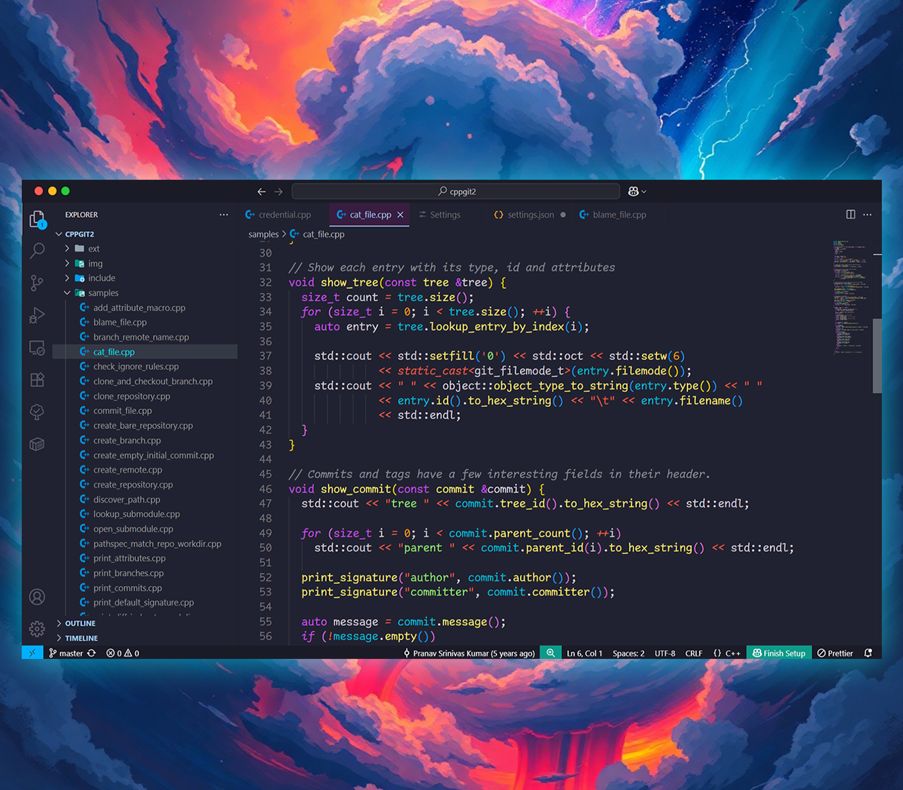
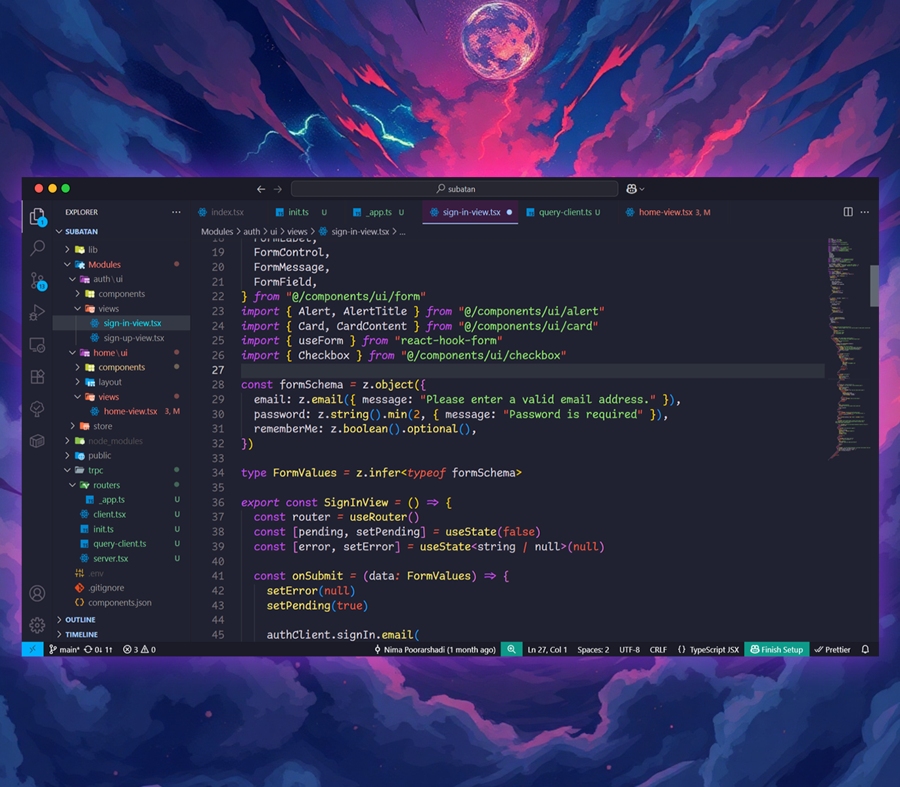
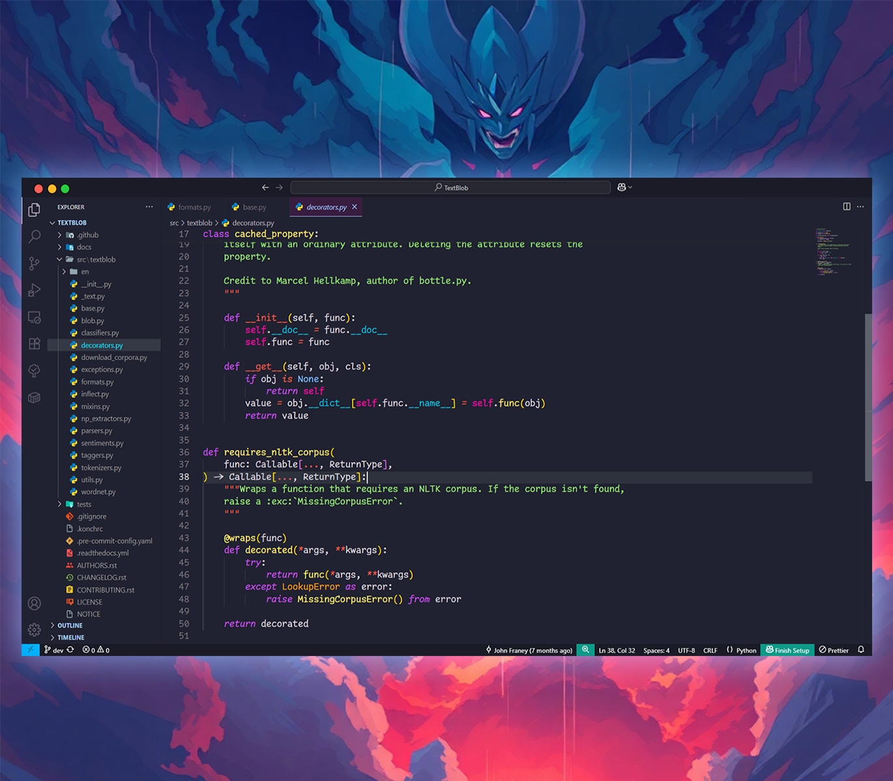

# Cosmic Aura Theme for VS Code

  
  
   
  

> **NOTE**: The default italic keywords in Cosmic Aura look especially good with the **Comic Code** font.

## Features

- Deep cosmic backgrounds with vibrant highlights
- Balanced contrast for readability
- Syntax highlighting for **C++, Python, JavaScript, and JSON**
- Clean UI elements with subtle shadows
- Designed for long coding sessions

## Installation

1. Open VS Code
2. Go to Extensions (`Ctrl+Shift+X` or `Cmd+Shift+X`)
3. Search for **Cosmic Aura**
4. Click **Install**
5. Go to **Color Theme** and select **Cosmic Aura**
6. 🌟 Enjoy and [Rate five-stars](https://marketplace.visualstudio.com/items?itemName=NimaPoorarshadi.cosmic-aura&ssr=false#review-details).

## Why Cosmic Aura?

Whether you’re navigating galaxies of C++, exploring Python nebulae, or structuring JSON data, **Cosmic Aura** delivers a theme that feels truly out of this world. 🚀

## License

[MIT](https://github.com/NimaPoorarshadi/CosmicAuraTheme/blob/master/LICENSE.md)
