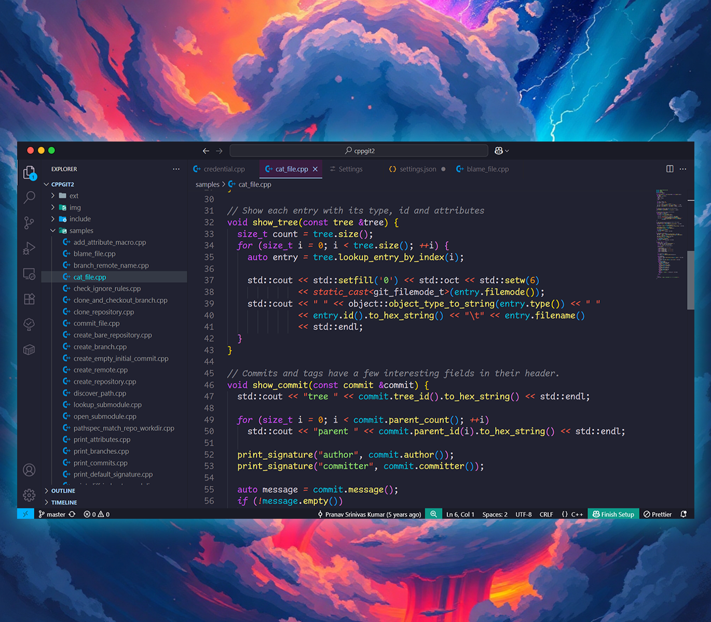
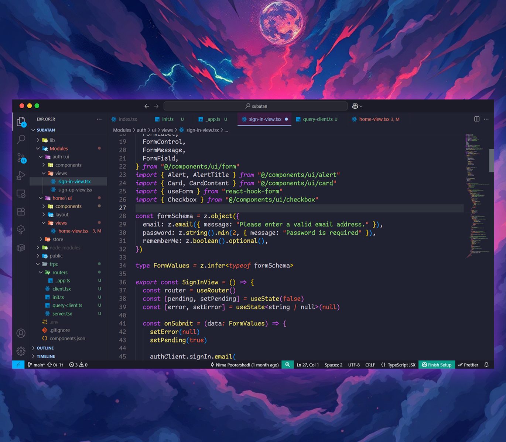
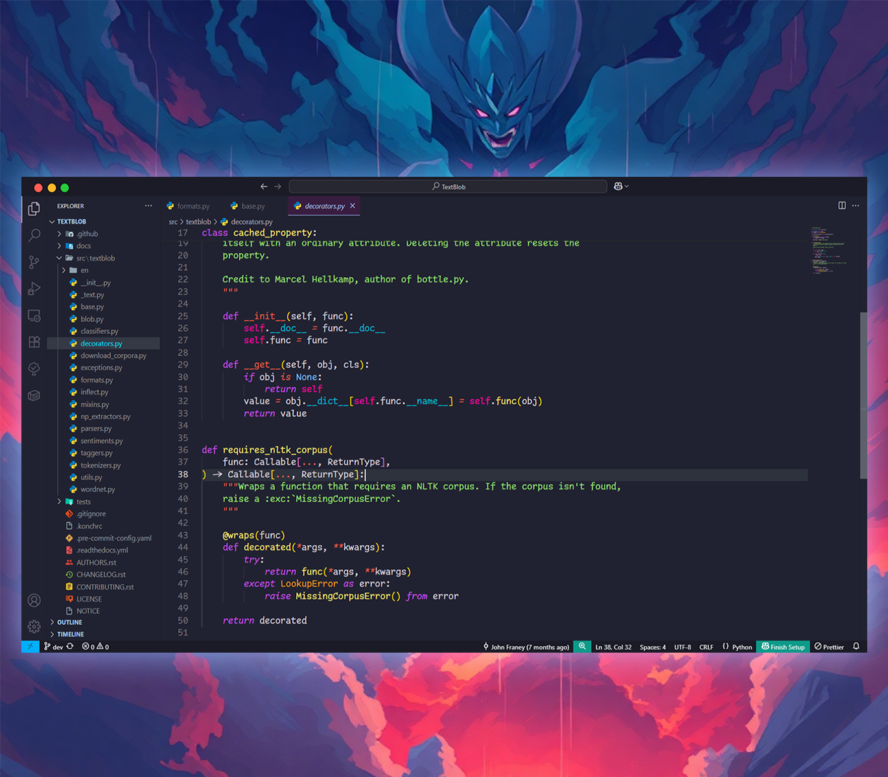
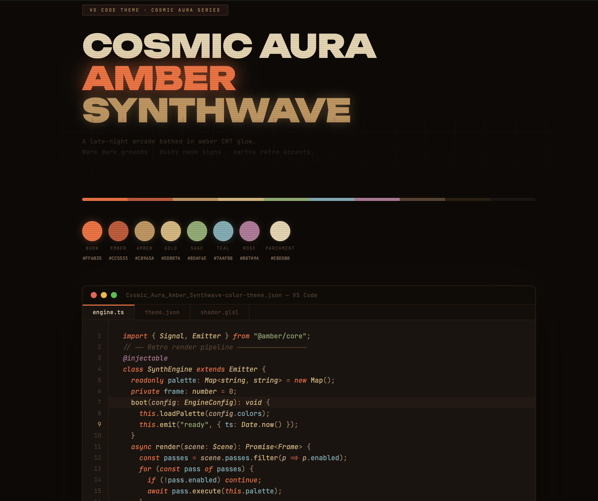
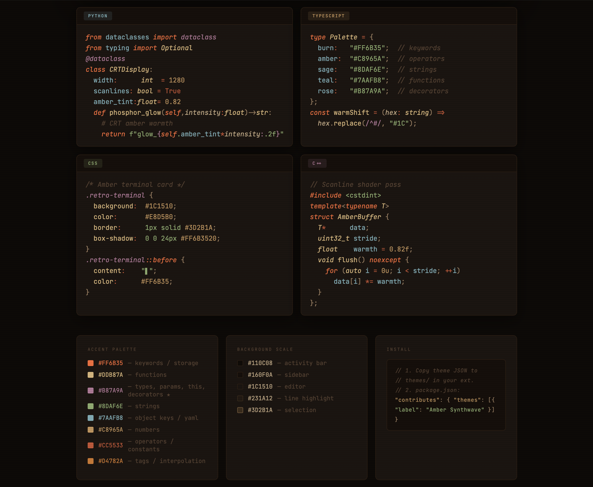
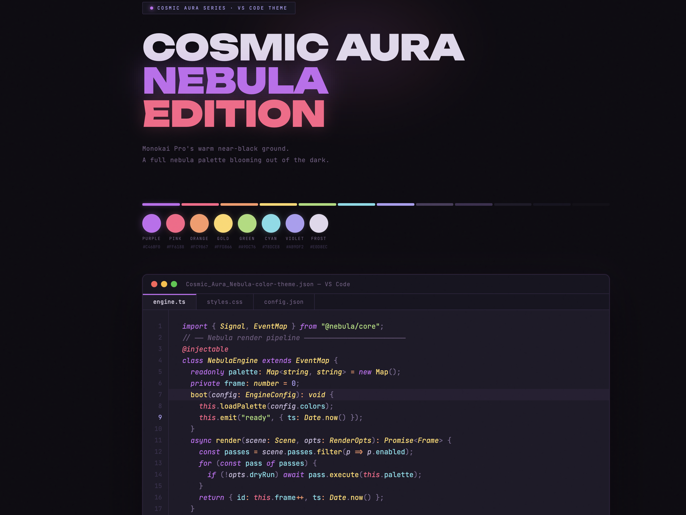
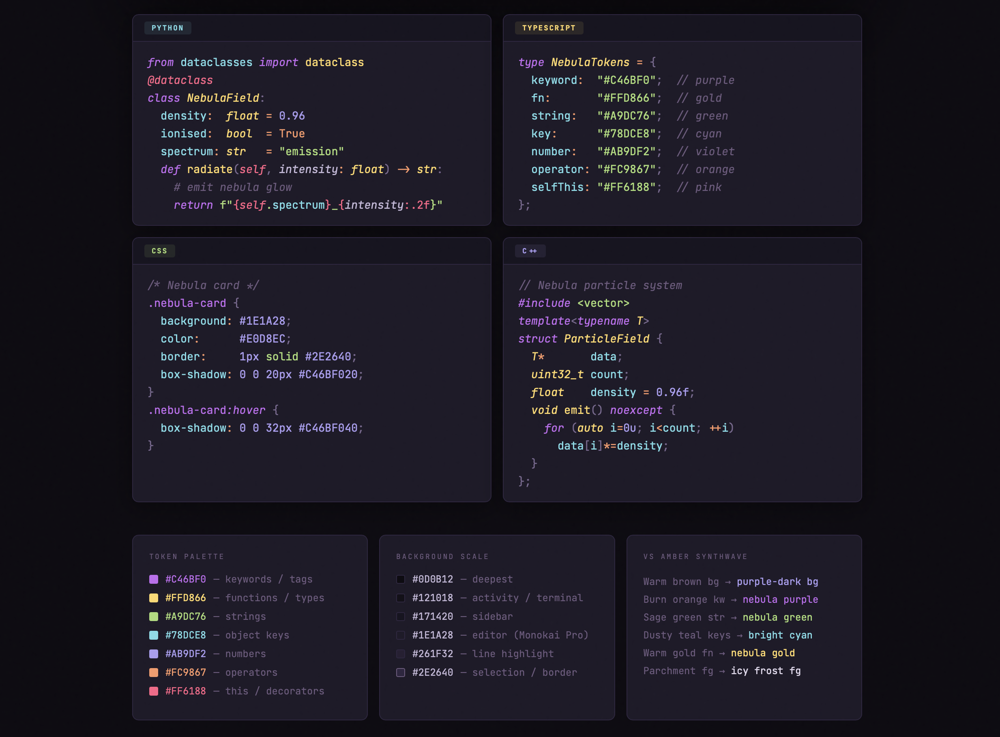

# Cosmic Aura Theme for VS Code

  
  
  
  

---

## 🌌 Three Variations. One Universe.

> **NOTE**: The italic keywords in all Cosmic Aura variations look especially good with the **Comic Code** font.

---

### ✦ Cosmic Aura — Aurora
> The original. Electric cyan, hot magenta, vivid lime — deep indigo grounds with neon colors dancing like the northern lights.

---

### 🔥 Cosmic Aura — Amber Synthwave
> A retro-80s variation. Warm amber-brown dark grounds, dusty earthy accents — like coding on a late-night CRT arcade screen.

---

### 🌠 Cosmic Aura — Nebula
> The darkest variation. Deep purple near-black grounds inspired by Monokai Pro, with a full nebula palette blooming out of the dark.

---

## Features

- Three distinct variations selectable from the Color Theme picker
- Deep cosmic backgrounds with vibrant highlights
- Balanced contrast for long coding sessions
- Syntax highlighting for **C++, Python, JavaScript, and JSON**
- Clean UI elements with subtle shadows

## Installation

1. Open VS Code
2. Go to Extensions (`Ctrl+Shift+X` or `Cmd+Shift+X`)
3. Search for **Cosmic Aura**
4. Click **Install**
5. Go to **Color Theme** (`Ctrl+K Ctrl+T`) and choose your variation:
   - **Cosmic Aura — Aurora**
   - **Cosmic Aura — Amber Synthwave**
   - **Cosmic Aura — Nebula**
6. 🌟 Enjoy and [Rate five-stars](https://marketplace.visualstudio.com/items?itemName=NimaPoorarshadi.cosmic-aura&ssr=false#review-details).

## Why Cosmic Aura?

Whether you're navigating galaxies of C++, exploring Python nebulae, or structuring JSON constellations — **Cosmic Aura** delivers a theme series that feels truly out of this world. Three variations, one universe. 🚀

## License

[MIT](https://github.com/NimaPoorarshadi/CosmicAuraTheme/blob/master/LICENSE.md)
